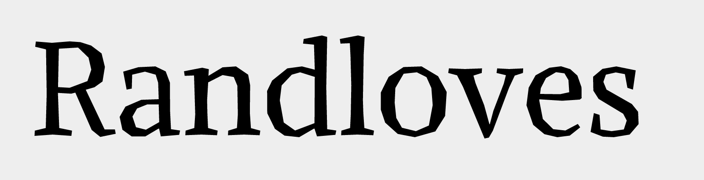

### Alike Angular

Alike Angular is a complementary titling style to Alike Regular.
It shares the same proportions as its counterpart 
for compatibility, and is designed for larger display sizes.

As opposed to the soft Regular its letterforms consist 
of only straight splines and additional expressive
features are introduced in characters like T, Z, M, E.

Designed by Svetlana Sebyakina 2009-2011

Alike Angular is a Unicode typeface family that supports 
languages that use the Latin script and its variants, and 
could be expanded to support other scripts.

### Copyright
Copyright 2009 (c) Svetlana Sebyakina (http://sebyakina.com/)

Copyright 2011 (c) Cyreal (www.cyreal.org)

### License

This Font Software is licensed under the SIL Open Font License, Version 1.1. This license is available with a FAQ at: [http://scripts.sil.org/OFL](http://scripts.sil.org/OFL)